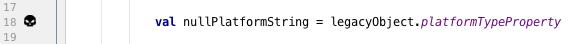
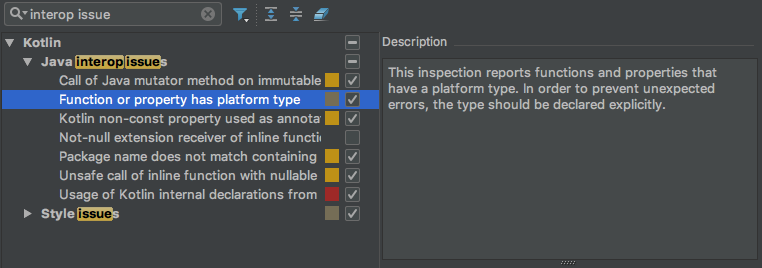

# skullbones
Skull and Bones - Kotlin platform type usage marker

Slightly exaggerated marking tool to avoid relying on Platform Types in Kotlin code.

[Download Version 0.2](https://github.com/rcgroot/skullbones/releases/download/v0.2/SkullsBones.zip)

Install the plugin zip file by opening the plugins preferences in your IntelliJ or Android Studio and clicking the `Install plugin from disk...`

# Platform type in a nutshell

When invoking Java code from Kotlin it is sometimes unknown if the type is Nullable.
For example a getter could be called that that has no `@Nullable` or `@NonNull` annotation. That type is
called a platform type, sometimes denoted by an exclamation mark. E.g. `String!` for the platform String type.

The current version of the Kotlin compiler hopes for the best and allows the platform type to be treated as non-null.
Sometimes that hope is shattered by an IllegalStateExceptions when at *runtime* the assumed value is null.

# Example

# Inspections

Also the code analyser can help reduce the platform type dangers. Check out the Kotlin inspection, it will give out a `weak warning` when using platform types.

